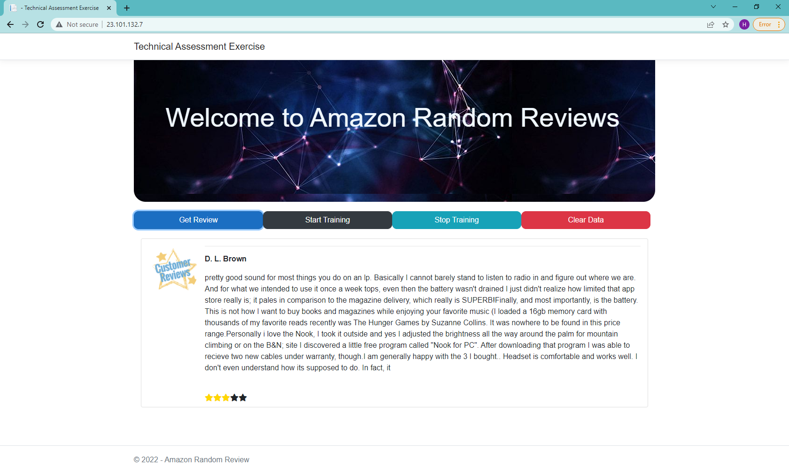

# Amazon Reviews Application

## Overview
In the realm of e-commerce, product reviews serve as a crucial source of information for potential buyers, influencing their purchasing decisions. In this assignment, we delve into the intriguing world of automatically generating Amazon product reviews. 

The task at hand involves creating an ASP.NET Core application capable of ingesting training data and generating reviews dynamically. We're encouraged to leverage Markov chains, a statistical model for generating sequences of elements, to accomplish this task efficiently.

### Problem Description

For this assignment, our objective is to develop an ASP.NET Core application that automates the generation of Amazon product reviews. Here's a breakdown of the requirements:

- **Data Ingestion**: Download one of the 5-core subsets from [http://jmcauley.ucsd.edu/data/amazon/](http://jmcauley.ucsd.edu/data/amazon/). You can select any category or combine multiple categories for training purposes.

- **Review Generation**: Utilize Markov chains to generate reviews dynamically. Each time the "/API/generate" endpoint is hit, the application should produce a new review.

### Deliverables

- **ASP.NET Core Application**: The application should expose a single endpoint ("/API/generate") that returns a JSON object containing an autogenerated review along with a randomized star rating ranging from 1 to 5.

- **Data Ingestion**: Ensure that the training data is ingested and used for generating reviews during program startup.

This assignment offers an exciting opportunity to explore the realm of natural language generation and machine learning techniques in the context of e-commerce. Let's dive into the development process and create an application that demonstrates the power of automated review generation!

## Deliverables

- **ASP.NET Core Application**: A single endpoint `/API/generate` that returns a JSON object containing an autogenerated review and a randomized star rating between 1 and 5.
- **Data Ingestion/Training**: The application ingests and trains data during program startup.

## Setup Instructions

1. **Database Setup**: 
    - The repository contains a `database` folder with the SQL script `DBScript.txt` to create all necessary database objects.
    - Run the script to set up the database.

2. **Configuration**:
    - Update the `appsettings.json` file according to your environment:
    ```json
    {
        "Logging": {
            "LogLevel": {
                "Default": "Information",
                "Microsoft": "Warning",
                "Microsoft.Hosting.Lifetime": "Information"
            }
        },
        "AllowedHosts": "*",
        "ConnectionString": "Server=DESKTOP-JDJ9GL7\\SQLEXPRESS01;Database=ReviewsData;Uid=HNaser;Pwd=iiiposksc",
        "ConnectionStringLocalA": "Server=(localdb)\\v11.0;Database=ReviewsData;Trusted_Connection=True;",
        "ConnectionStringLocalB": "Server=(localdb)\\v11.0;Database=ReviewsData;Uid=HNaser;Pwd=iiiposksc",
        "GzipFileName": "C:\\myDevBox\\PracticeCode\\AmazonReviewRandom\\Data\\reviews_Musical_Instruments_5.json.gz",
        "BufferSize": "1048576",
        "KeySize": "3",
        "OutputSize": "200",
        "ReviewersName": "Wayne Smith,Billy G. Noland ,Christian,D. L. Brown,Mark Dietter,Matenai,AllyMG,Amazon Customer,Gena,Jake,J. Clement,John,Nicodimus,T. Vaughan,Alberto Dieguez,Allen Coberly,Amazon Customer,Amazon Customer,Amazon Customer,Amazon Customer,anthony smith,A. Ramos,Benjamin Belanger,B. Kilpatrick,B. Onat,bonbon,bone,Boyd,Bradley Pool,Branon Young,Brian M. Kaplan,Busy Momma,C. Aaland,cajunjake,cameron,Captain,Carolyn D,Castle,Charlie Troutman,chicago mom,chitownrun,Chris C,chuckn,C. Johansen,C. Lackey,costaricachris,Curtis G,Dave C,David,D. Durbin"
    }
    ```

3. **Running the Application**:
    - **Docker**: A Dockerfile is included in the project for containerization.
        - Docker Image: The Docker image is available on Docker Hub and can be pulled using the following command:
          ```bash
          docker pull hamidnaser11061213/amazonreviews
          ```


## Features

- **Markov Chains**: Utilizes Markov chains to populate the database with keys and options (e.g., `Key[ A very] => Options[good, worthy]`).
- **API Endpoints**:
    - `GET /API/generate`: Generates a random review.
    - **Frontend Controls**:
        - **Get Review**: Generates a random review.
        - **Start Training**: Begins data ingestion/training.
        - **Stop Training**: Stops data ingestion/training.
        - **Clear Data**: Clears the database.

## Database Script

```sql
/* Rebuild
DROP TABLE Options, Keys;
*/

IF NOT EXISTS (SELECT * FROM sys.tables WHERE name = 'Keys')
CREATE TABLE Keys (
    KeyID int IDENTITY(1,1) NOT NULL PRIMARY KEY,
    [Key] nvarchar(100) NOT NULL UNIQUE
)

IF NOT EXISTS (SELECT * FROM sys.tables WHERE name = 'Options')
CREATE TABLE Options (
    KeyID int NOT NULL CONSTRAINT FK_Options_KeyID REFERENCES Keys,
    [Option] nvarchar(100) NOT NULL,
    PRIMARY KEY (KeyID, "Option")
)
GO

/* Tests
INSERT INTO Keys VALUES ('One')
INSERT INTO Options VALUES (1, 'Option 1')
SELECT COUNT(*) FROM Keys
SELECT COUNT(*) FROM Options
EXEC sp_ClearTables
*/
CREATE OR ALTER PROCEDURE sp_ClearTables AS
DECLARE @SQL VARCHAR(2000)
SET @SQL='
ALTER TABLE Options DROP CONSTRAINT FK_Options_KeyID
TRUNCATE TABLE Options
TRUNCATE TABLE Keys
ALTER TABLE Options ADD CONSTRAINT FK_Options_KeyID FOREIGN KEY (KeyID) REFERENCES Keys'
EXEC (@SQL)
GO

CREATE OR ALTER VIEW v_Options AS
SELECT k.*, o.[Option]
FROM Keys k
JOIN Options o ON (o.KeyID = k.KeyID)
GO

/* Tests
SELECT COUNT(*)/1000000 FROM Keys
SELECT TOP 100 * FROM Keys ORDER BY [Key]
DECLARE @KeyID int EXEC @KeyID = sp_GetKeyID 'key1' SELECT @KeyID AS KeyID
*/
CREATE OR ALTER PROCEDURE sp_GetKeyID @Key nvarchar(100), @KeyID int = NULL OUTPUT AS
BEGIN
    SELECT @KeyID = KeyID FROM Keys WHERE [Key] = @Key
    IF @@ROWCOUNT = 0
    BEGIN
        SET NOCOUNT ON
        INSERT INTO Keys ([Key]) VALUES (@Key)
        SET @KeyID = SCOPE_IDENTITY()
    END
    RETURN @KeyID
END
GO

/* Tests
SELECT TOP 100 * FROM v_Options ORDER BY 2, 3
DECLARE @KeyID int EXEC @KeyID = sp_AddKeyOption 'key1', 'value3'
*/
CREATE OR ALTER PROCEDURE sp_AddKeyOption @Key nvarchar(100), @Option nvarchar(100), @KeyID int = NULL OUTPUT AS
BEGIN -- Passing @KeyID is faster, but it's optional. If @KeyID is passed, value of @Key is ignored
    IF @KeyID IS NULL
        EXEC @KeyID = sp_GetKeyID @Key
    IF NOT EXISTS (SELECT KeyID FROM Options WHERE KeyID = @KeyID AND [Option] = @Option)
    BEGIN
        SET NOCOUNT ON
        INSERT INTO Options (KeyID, [Option]) VALUES (@KeyID, @Option)
    END
    RETURN @KeyID
END
GO

/* Tests
SELECT COUNT(*)/1000000 FROM Keys
SELECT TOP 100 * FROM Keys ORDER BY KeyID
DECLARE @KeyID int EXEC @KeyID = sp_GetRandomKeyID SELECT @KeyID AS KeyID
*/
CREATE OR ALTER PROCEDURE sp_GetRandomKeyID @KeyID int = NULL OUTPUT AS
BEGIN
    DECLARE @MinKeyID int
    DECLARE @MaxKeyID int
    DECLARE @RandomKeyID int
    SELECT @MinKeyID = Min(KeyID), @MaxKeyID = Max(KeyID) FROM Keys

    SET @RandomKeyID = FLOOR(RAND()*(@MaxKeyID+1-@MinKeyID))+@MinKeyID
    SELECT @KeyID = KeyID FROM Keys WHERE KeyID = @RandomKeyID
    IF @@ROWCOUNT = 0 -- Hit a hole, must have been deleted
    BEGIN
        SELECT @KeyID = Min(KeyID) FROM Keys WHERE KeyID > @RandomKeyID -- Get the next one in the sequence
        IF @@ROWCOUNT = 0
            SELECT @KeyID = Max(KeyID) FROM Keys WHERE KeyID < @RandomKeyID -- Try the last one in the sequence then
    END

    RETURN @KeyID
END
GO

/* Tests
SELECT COUNT(*)/1000000 FROM Keys
SELECT TOP 100 FROM Keys
DECLARE @KeyID int, @Key nvarchar(100) EXEC @KeyID = sp_GetRandomKey @Key = @Key OUTPUT SELECT @KeyID AS KeyID, @Key AS [Key]
*/
CREATE OR ALTER PROCEDURE sp_GetRandomKey @Key nvarchar(100) OUTPUT, @KeyID int = NULL OUTPUT AS
BEGIN
    EXEC @KeyID = sp_GetRandomKeyID
    SELECT @Key = [Key] FROM Keys WHERE KeyID = @KeyID
    RETURN @KeyID
END
GO

DROP PROCEDURE IF EXISTS sp_GetRandomKeyAndValue -- renamed to sp_GetRandomKeyAndOption
GO

/* Tests
SELECT TOP 100 * FROM v_Options ORDER BY [Key], [Option]
DECLARE @KeyID int, @Key nvarchar(100), @Option nvarchar(100) EXEC @KeyID = sp_GetRandomKeyAndValue @Key = @Key OUTPUT, @Option = @Option OUTPUT SELECT @KeyID AS KeyID, @Key AS [Key], @Option AS [Option]
*/
CREATE OR ALTER PROCEDURE sp_GetRandomKeyAndOption @Key nvarchar(100) OUTPUT, @Option nvarchar(100) OUTPUT, @KeyID int = NULL OUTPUT AS
BEGIN
    DECLARE @RandomKeyID int
    IF @KeyID IS NULL -- if passed a value, restricts the values to that particular KeyID
    BEGIN
        EXEC @RandomKeyID = sp_GetRandomKeyID
        SELECT TOP 1 @KeyID = @KeyID FROM Options WHERE KeyID = @RandomKeyID
    END
    IF @@ROWCOUNT = 0 -- Hit a hole, must have been deleted
    BEGIN
        SELECT @KeyID = Min(KeyID) FROM Options WHERE KeyID > @RandomKeyID -- Get the next one in the sequence
        IF @@ROWCOUNT = 0
            SELECT @KeyID = Max(KeyID) FROM Options WHERE KeyID < @RandomKeyID -- Try the last one in the sequence then
    END;

    WITH opts AS (SELECT ROW_NUMBER() OVER (ORDER BY [Option]) AS rowno, * FROM Options WHERE KeyID = @KeyID)
    SELECT @Key = k.[Key], @Option = opts.[Option]
    FROM opts
    JOIN Keys k ON (k.KeyID = opts.KeyID)
    WHERE opts.rowno = (SELECT FLOOR(RAND()*MAX(rowno))+1 FROM opts);

    RETURN @KeyID
END
GO

IF OBJECT_ID('tempdb..#NewOptions') IS NOT NULL DROP TABLE #NewOptions
CREATE TABLE #NewOptions ([Key] nvarchar(100) NOT NULL, [Option] nvarchar(100) NOT NULL)
GO

/* Tests
IF OBJECT_ID('tempdb..#NewOptions') IS NOT NULL DROP TABLE #NewOptions
CREATE TABLE #NewOptions ([Key] nvarchar(100) NOT NULL, [Option] nvarchar(100) NOT NULL)
INSERT INTO #NewOptions VALUES ('bulk1', 'bulkoption1')
INSERT INTO #NewOptions VALUES ('bulk1', 'bulkoption2')
INSERT INTO #NewOptions VALUES ('bulk1', 'bulkoption3')
INSERT INTO #NewOptions VALUES ('bulk1', 'bulkoption4')
INSERT INTO #NewOptions VALUES ('bulk2', 'bulkoption1')
INSERT INTO #NewOptions VALUES ('bulk2', 'bulkoption2')
INSERT INTO #NewOptions VALUES ('bulk2', 'bulkoption3')
INSERT INTO #NewOptions VALUES ('bulk2', 'bulkoption4')
SELECT * FROM #NewOptions
EXEC sp_AddKeysAndOptionsFromStaging
SELECT * FROM v_Options WHERE [Key] IN ('bulk1', 'bulk2')
DROP TABLE #NewOptions

SELECT COUNT(*)/(1000000) FROM Keys
SELECT COUNT(*)/(1000000) FROM Options
SELECT @@VERSION
*/
CREATE OR ALTER PROCEDURE sp_AddKeysAndOptionsFromStaging AS
BEGIN
    -- uses temp staging table #NewOptions, created as 
    -- Inserts all new keys and options from temporary table #NewOptions

    INSERT INTO Keys ([Key])
    SELECT DISTINCT [Key]
    FROM #NewOptions new
    WHERE NOT EXISTS (SELECT * FROM Keys WHERE [Key] = new.[Key])

    INSERT INTO Options (KeyID, [Option])
    SELECT DISTINCT k.KeyID, new.[Option]
    FROM #NewOptions new
    JOIN Keys k ON (k.[Key] = new.[Key])
    WHERE NOT EXISTS (SELECT KeyID FROM Options WHERE KeyID = k.KeyID AND [Option] = new.[Option])
END
GO

DROP TABLE #NewOptions
GO
